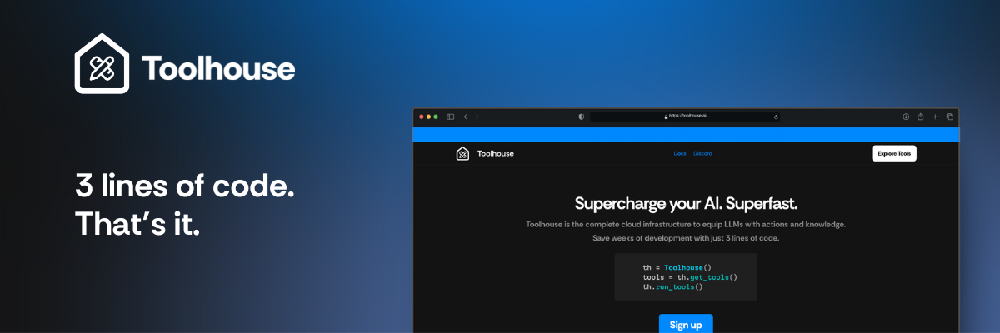
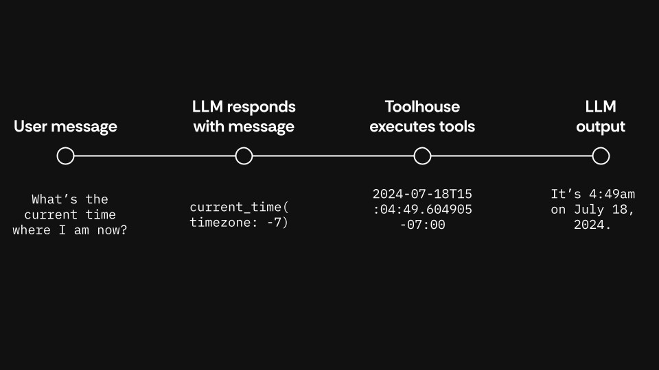

# Toolhouse Python SDK

Welcome to the [Toolhouse Python SDK](https://docs.toolhouse.ai/toolhouse/quick-start-python) documentation. This guide will help you get started with integrating and using the SDK in your project.

[](https://docs.toolhouse.ai/)   

Toolhouse allows you to unlock the best LLM knowledge and actions. It works across a wide ranges or LLMs and providers.

With Toolhouse, you can run and execute them in the cloud, without the need to handling their execution locally.

For more details, you can check out our [documentation](https://docs.toolhouse.ai).



## Table of Contents

- [Toolhouse Python SDK](#toolhouse-python-sdk)
  - [Table of Contents](#table-of-contents)
  - [About the API](#about-the-api)
  - [Installation](#installation)
    - [Getting started](#getting-started)
    - [Providers](#providers)
  - [Sample usage](#sample-usage)
  - [Use Local Tools](#use-local-tools)
  - [Use Bundles](#use-bundles)
  - [Contributing](#contributing)
  - [Publishing tools](#publishing-tools)
  - [License](#license)

## About the API

The Toolhouse API provides access to various AI-powered tools and services, that you can find on [Toolhouse](https://app.toolhouse.ai).

## Installation

With `pip`:

```pip install toolhouse```

With `poetry`:

```poetry add toolhouse```

### Getting started

In order to use the SDK, you will need a Toolhouse API key. To get the API key:

1. [Sign up for Toolhouse](https://app.toolhouse.ai/auth/sign-up) or [log in](https://app.toolhouse.ai/auth/login) if you are an existing Toolhouse user.
1. Go to your user ➡️ API Keys ([direct link](https://app.toolhouse.ai/settings/api-keys))
1. Give your API key a name and click Generate.

Copy the API Key and save it where you save your secrets. We'll assume you have a .env file.

We suggest saving your API Key as `TOOLHOUSE_API_KEY` in your environment file. This allows Toolhouse to pick up its value directly in your code.

```bash
TOOLHOUSE_API_KEY=<Your API Key value>
```

Alternatively, you can set the API key when you initialize the SDK. You can do this in the constructor:

```py
tools = Toolhouse('YOUR_API_KEY')
```

You can also use the `set_api_key` method:

```py
tools = Toolhouse()
tools.set_api_key('YOUR_API_KEY')
```

Our [Quick start guide](https://docs.toolhouse.ai/toolhouse/quick-start) has all you need to get you set up quickly.

### Providers

Toolhouse works with the widest possible range of LLMs across different providers. By default, the Toolhouse API will work with any LLM that is compatible with the OpenAI chat completions API.

You can switch providers when initializing the SDK through the constructor:

```py
from toolhouse import Toolhouse, Provider
tools = Toolhouse(provider=provider.ANTHROPIC)
```

If you are passing your API key:

```py
from toolhouse import Toolhouse, Provider
tools = Toolhouse('YOUR_API_KEY', provider.ANTHROPIC)
```

## Sample usage

In this example, we'll use the OpenAI SDK as well as dotenv.

```sh
pip install python-dotenv
```

Create a `.env` and add your API keys there.

```bash
TOOLHOUSE_API_KEY=
OPENAI_API_KEY=
```

Toolhouse has the `current_time` pre-installed on your account.

```py
import os
from dotenv import load_dotenv
from toolhouse import Toolhouse
from openai import OpenAI
from typing import List

load_dotenv()

TH_API_KEY = os.getenv("TOOLHOUSE_API_KEY")
OAI_KEY = os.getenv("OPENAI_API_KEY")

client = OpenAI(api_key=OAI_KEY)
th = Toolhouse(api_key=TH_API_KEY, provider="openai")

#Metadata to convert UTC time to your localtime
th.set_metadata("timezone", -7)

messages: List = [{
    "role": "user",
    "content": "What's the current time?"
}]

response = client.chat.completions.create(
    model='gpt-4o',
    messages=messages,
    tools=th.get_tools(),
    tool_choice="auto"
)

messages += th.run_tools(response)

response = client.chat.completions.create(
            model="gpt-4o-mini",
            messages=messages,
            tools=th.get_tools(),
            tool_choice="auto"
        )
print(response.choices[0].message.content)
```

## Use Local Tools

To utilize a local tool, you need to define the tool, its JSON schema, and register it with the Toolhouse SDK. Here's a step-by-step guide:

1. Create the local tool function.
2. Define the JSON schema for the local tool function.
3. Register the local tool with the Toolhouse SDK.
4. Add the local tool to the messages.
5. Utilize the local tool within the Toolhouse SDK.

Here is a sample code:

```py
"""OpenAI Sample"""
import os
from typing import List
from dotenv import load_dotenv
from openai import OpenAI
from toolhouse import Toolhouse

#  Make sure to set up the .env file according to the .env.example file.
load_dotenv()

TH_API_KEY = os.getenv("TOOLHOUSE_API_KEY")
OAI_KEY = os.getenv("OPENAI_API_KEY")

local_tools = [
    {'type': 'function',
     'function':
         {
             'name': 'hello',
             'description': 'The user receives a customized hello message from a city and returns it to the user.', 
             'parameters': {
                 'type': 'object',
                 'properties': {
                     'city': {'type': 'string', 'description': 'The city where you are from'}
                 }},
             'required': ['city']
         }}]

th = Toolhouse(api_key=TH_API_KEY, provider="openai")
th.set_metadata("id", "fabio")
th.set_metadata("timezone", 5)


@th.register_local_tool("hello")  # the name used to register the tool should be the same as the name in the json schema
def hello_tool(city: str):
    """Return a Hello message from a specific city."""
    return f"Hello from {city}!!!"


client = OpenAI(api_key=OAI_KEY)

messages: List = [{
    "role": "user",
    "content":
        "Can I get a hello from Rome?"
    }]

response = client.chat.completions.create(
    model='gpt-4o',
    messages=messages,
    tools=th.get_tools() + local_tools
)

messages += th.run_tools(response)

response = client.chat.completions.create(
            model="gpt-4o",
            messages=messages,
            tools=th.get_tools() + local_tools
        )

print(response.choices[0].message.content)
```

## Use Bundles

Bundles help you define groups of tools you want to pass to the LLM based on specific contextual need.

For example, if you want to enhance your LLM's knowledge with live stock market data, you can create a Bundle with a stock price API call, a RAG for stock news, and summarization of SEC filings.
In order to create a bundle, you need to:

1. Head over to Toolhouse and create a new [bundle](https://app.toolhouse.ai/bundles). eg: "stock_bundle"
2. Add tools to the bundle.
3. Use the bundle in the Toolhouse SDK.

Here is a sample code:

```py
import os
from typing import List
from dotenv import load_dotenv
from openai import OpenAI
from toolhouse import Toolhouse

#  Make sure to set up the .env file according to the .env.example file.
load_dotenv()

th = Toolhouse(api_key=TH_API_KEY, provider="openai")
th.set_metadata("id", "fabio")  # metadata is optional based on the tools you are using
th.set_metadata("timezone", 5)  # metadata is optional based on the tools you are using

client = OpenAI(api_key=OAI_KEY)

messages: List = [{
    "role": "user",
    "content": "What is the stock price of Apple?"
    }]

response = client.chat.completions.create(
    model='gpt-4o',
    messages=messages,
    tools=th.get_tools(bundle="stock_bundle")
)
```

## Contributing

We welcome pull requests that add meaningful additions to these code samples, particularly for issues that can expand compability.

You can submit issues (for example for feature requests or improvements) by using the Issues tab.

## Publishing tools

Developers can also contribute to Toolhouse by publishing tools. Toolhouse allows developers to submit their tools and monetize them every time they're executed. Developers and tools must go through an review and approval process, which includes adhering to the Toolhouse Privacy and Data Protection policy. If you're interested in becoming a publisher, [submit your application](https://tally.so/r/wzeO68).

## License

This SDK is licensed under the Apache-2.0 License. See the [LICENSE](LICENSE) file for more details.
